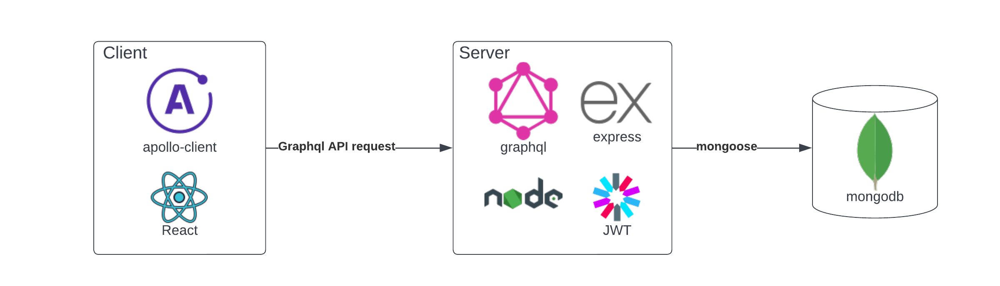

# Overview

Quotely is a full-stack web application built with React.js, Express.js, GraphQL, and MongoDB, providing users with a platform to share and explore quotes. Users can sign up or log in securely using bcrypt.js for password hashing and JSON Web Tokens (JWT) for authentication. The frontend utilizes React.js and Apollo Client for dynamic UI rendering and efficient data fetching from the GraphQL API endpoint powered by Apollo Server integrated with Express.js. MongoDB, managed with Mongoose, serves as the database for storing user information and quotes. React Router enables smooth client-side routing, while Apollo Client handles GraphQL queries and mutations for seamless interaction with the backend. 

## Features

- **User Authentication**: Users can sign up, log in, and log out securely.
- **Profile Management**: Users can view their profile information, including their name, email, and quotes.
- **Quote Creation**: Authenticated users can create new quotes and associate them with their profile.
- **Quote Exploration**: Users can explore quotes created by other users.
- **Responsive Design**: The application is responsive and works well on desktop and mobile devices.

## Technologies Used

- **Frontend**: React.js, React Router, Apollo Client
- **Backend**: Node.js, Express.js, Apollo Server, GraphQL
- **Database**: MongoDB (via Mongoose)
- **Authentication**: JSON Web Tokens (JWT), bcrypt.js
- **Deployment**: Render (Backend), Vercel (Frontend)

## Architecture

## Frontend Layout

-  

- 

## Getting Started

To run the Quotely application locally, follow these steps:

1. Clone this repository to your local machine: `git clone https://github.com/KumaarBalbir/quotely.git`
2. Navigate to the project directory: `cd quotely`
3. Install dependencies for both the frontend and backend: for server side `npm install` and for frontend side `cd client` and then `npm install`
4. Create a .env file in the root directory and define the following environment variables: `MONGO_URI` and `JWT_SECRET` ([generate-jwt-secret](https://dev.to/tkirwa/generate-a-random-jwt-secret-key-39j4))
5. Start backend server: `node server.js`
6. Start frontend development server in separate terminal `npm start` (make sure you are in client directory)
7. Open your web browser and visit `http://localhost:3000` to access the Quotely application.

